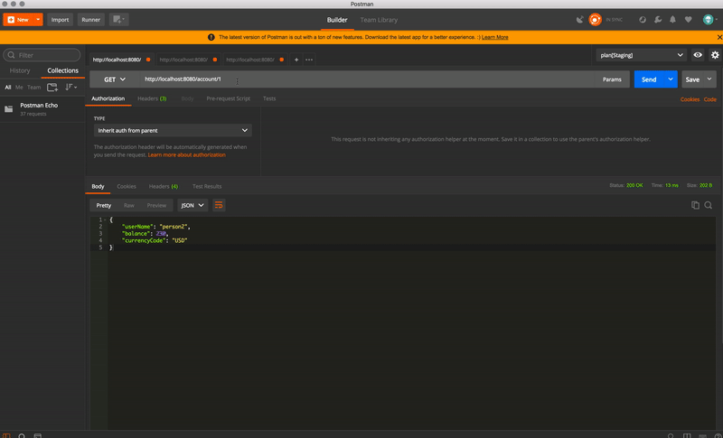

# Money Management Rest API

A Java RESTful API to transfer money between users accounts

### Technologies
- JAX-RS for REST API
- H2 in memory database
- Jetty Container (for Test and Demo app)
- Apache HTTP Client
- JUnit for unit tests and integration tests

### How to run
```sh
mvn exec:java
```

Application starts a jetty server on localhost port 8080 An H2 in memory database initialized with some sample user and account data To view

- http://localhost:8080/user/person1
- http://localhost:8080/account/1

### Available Services

| HTTP METHOD | PATH | USAGE |
| -----------| ------ | ------ |
| GET | /user/{userName} | get user by user name | 
| GET | /user/all | get all users | 
| PUT | /user/create | create a new user | 
| POST | /user/{userId} | update user | 
| DELETE | /user/{userId} | remove user | 
| GET | /account/{accountId} | get account by accountId | 
| GET | /account/all | get all accounts | 
| GET | /account/{accountId}/balance | get account balance by accountId | 
| PUT | /account/create | create a new account
| DELETE | /account/{accountId} | remove account by accountId | 
| PUT | /account/{accountId}/withdraw/{amount} | withdraw money from account | 
| PUT | /account/{accountId}/deposit/{amount} | deposit money to account | 
| POST | /transaction | perform transaction between 2 user accounts | 

### Http Status
- 200 OK: The request has succeeded
- 400 Bad Request: The request could not be understood by the server 
- 404 Not Found: The requested resource cannot be found
- 500 Internal Server Error: The server encountered an unexpected condition 

### Sample JSON for User and Account
##### User : 
```sh
{  
  "userName":"person1",
  "emailAddress":"person1@gmail.com"
} 
```
##### User Account: : 

```sh
{  
   "userName":"person1",
   "balance":200,
   "currencyCode":"USD"
} 
```

#### User Transaction:
```sh
{  
   "currencyCode":"USD",
   "amount":100,
   "fromAccountId":1,
   "toAccountId":2
}
```

#Live Demo
